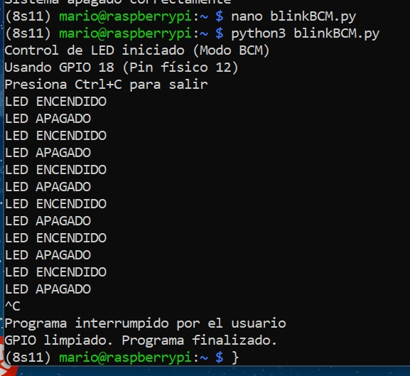
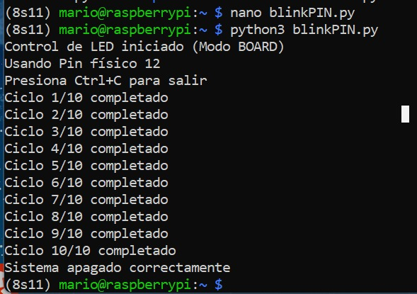
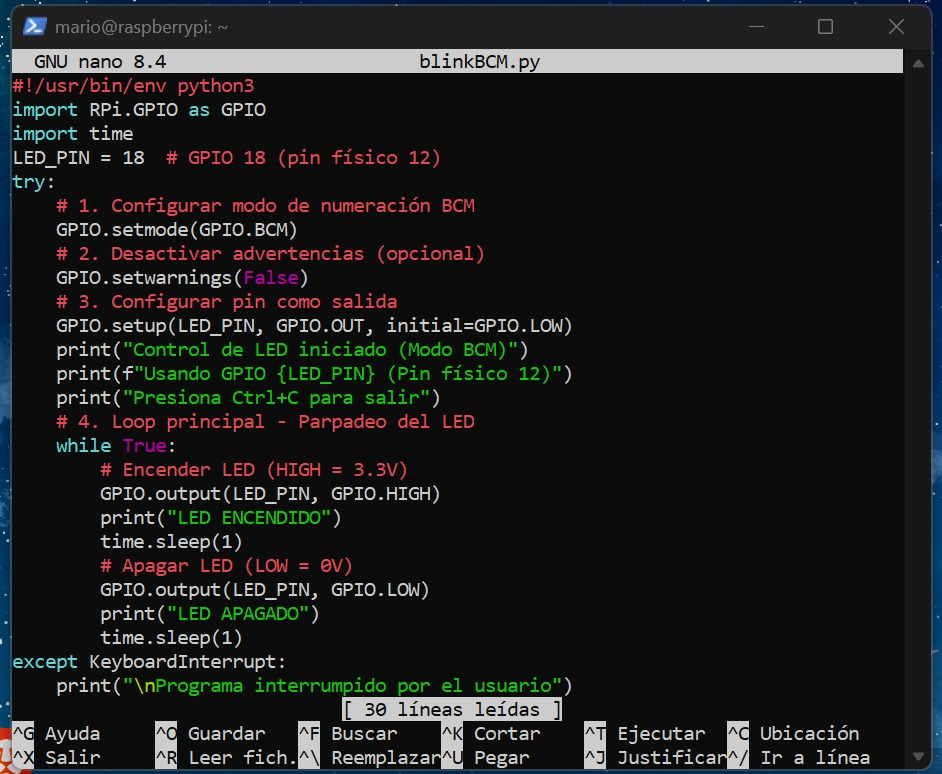
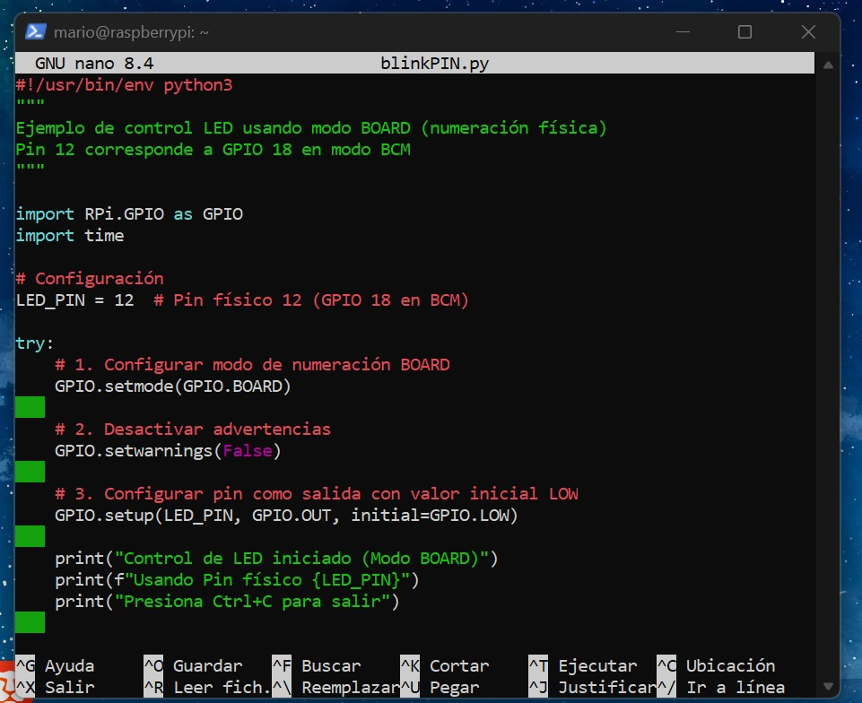
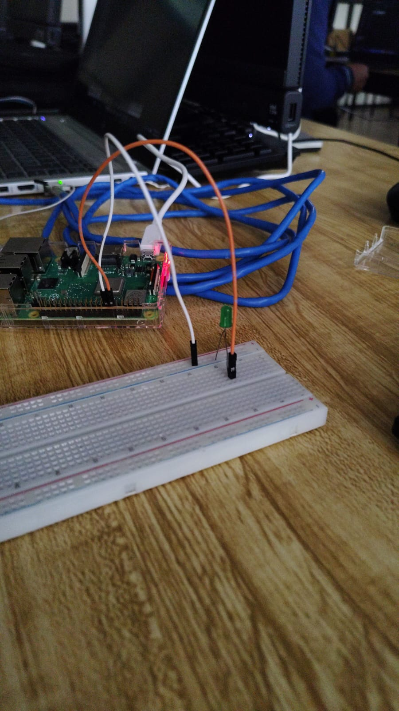
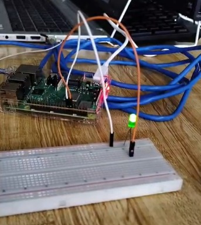

# P1 · LED Blink con Raspberry Pi

> Práctica 1: control de un LED mediante los pines GPIO de una Raspberry Pi, programado en Python y manejado de forma remota por SSH.

---

## 📖 Descripción general

El objetivo de esta práctica es hacer parpadear un LED desde una Raspberry Pi sin conectarle monitor ni teclado. Todo el trabajo se hizo a distancia: desde mi computadora con Windows abrí una sesión SSH hacia la Raspberry, escribí los scripts con `nano` y los ejecuté ahí mismo.

Se desarrollaron **dos versiones** del programa, cada una con una forma distinta de nombrar los pines:

- **BCM**: usa el número del chip Broadcom (GPIO).
- **BOARD**: usa el número físico del pin en la tira de 40 pines.

---

## 🧰 Herramientas utilizadas

| Elemento | Detalle |
| :--- | :--- |
| Equipo de trabajo | Computadora con Windows (terminal con cliente SSH) |
| Dispositivo remoto | Raspberry Pi con sistema Linux |
| Lenguaje | Python 3 |
| Librería | `RPi.GPIO` |
| Comunicación | SSH sobre red local |
| Editor | `nano` |

---

## 🔌 Conexión del circuito

Ambos programas controlan el **mismo pin**; lo único que cambia es cómo se le llama en el código.

| Script | Numeración | Referencia usada | Pin en la placa |
| :--- | :--- | :--- | :--- |
| `blinkBCM.py` | BCM | GPIO 18 | Pin 12 |
| `blinkPIN.py` | BOARD | Pin 12 | Pin 12 |

> 💡 El pin físico 12 equivale al GPIO 18, por eso el LED se conecta en el mismo lugar para las dos versiones.

---

## 🗂️ Estructura del repositorio

```text
P1_LedBlink/
├── blinkBCM.py
├── blinkPIN.py
├── README.md
└── imagenes/
    ├── BCMterminal.jpeg
    ├── PINterminal.jpeg
    ├── nanoBCM.jpeg
    ├── nanoPIN.jpeg
    ├── 1.jpeg
    └── 2.jpeg
```

---

## ▶️ Cómo reproducir la práctica

**1. Entrar a la Raspberry Pi por SSH**

```bash
ssh mario@192.168.137.160
```

**2. Crear los archivos**

```bash
nano blinkBCM.py
nano blinkPIN.py
```

**3. Ejecutarlos**

```bash
sudo python3 blinkBCM.py
sudo python3 blinkPIN.py
```

Para detener cualquiera de los dos programas basta con presionar `Ctrl + C`.

---

## 🧠 ¿Cómo funciona cada script?

### `blinkBCM.py`: parpadeo continuo

1. Importa `RPi.GPIO` y `time`, y guarda el pin en `LED_PIN = 18`.
2. Selecciona el modo BCM con `GPIO.setmode(GPIO.BCM)` y configura el pin como salida iniciando apagado.
3. Dentro de un `while True` repite sin parar:
   - pone el pin en `HIGH`, muestra `LED ENCENDIDO` y espera 1 s;
   - pone el pin en `LOW`, muestra `LED APAGADO` y espera 1 s.
4. Si el usuario presiona `Ctrl + C`, `try / except KeyboardInterrupt` corta el bucle sin errores.
5. El bloque `finally` llama a `GPIO.cleanup()` para liberar los pines al terminar.

### `blinkPIN.py`: ráfagas de parpadeo con contador

1. Importa las mismas librerías y define `LED_PIN = 12` (número físico).
2. Activa el modo BOARD con `GPIO.setmode(GPIO.BOARD)` y deja el pin como salida en estado bajo.
3. Ejecuta un `while contador < 10`, donde en cada vuelta:
   - un `for` enciende y apaga el LED **3 veces** con pausas de 0.2 s;
   - espera 1 s antes de la siguiente ronda;
   - suma 1 al contador y muestra por consola `Ciclo X/10 completado`.
4. También usa `try / except KeyboardInterrupt` y `finally` con `GPIO.cleanup()` para cerrar de forma segura.

### Diferencias clave

| Aspecto | `blinkBCM.py` | `blinkPIN.py` |
| :--- | :--- | :--- |
| Numeración | BCM | BOARD |
| Pin en el código | 18 | 12 |
| Patrón | 1 s encendido / 1 s apagado | 3 destellos rápidos + pausa |
| Duración | Infinita (hasta `Ctrl + C`) | 10 ciclos y termina |

---

## 🖼️ Evidencias

### Modo BCM

Salida en terminal con el LED alternando entre encendido y apagado:



Al interrumpir con `Ctrl + C` aparece el mensaje `GPIO limpiado. Programa finalizado.`

### Modo BOARD

Salida en terminal con el avance de los ciclos:



Al interrumpir con `Ctrl + C` aparece el mensaje `Sistema apagado correctamente`.

### Circuito armado





### LED funcionando





---

## ✅ Conclusiones

La práctica permitió comprobar que un mismo pin físico puede controlarse con dos esquemas de numeración distintos sin alterar el circuito, además de practicar el trabajo remoto por SSH y el uso correcto de `GPIO.cleanup()` para no dejar los pines en un estado indeterminado.
